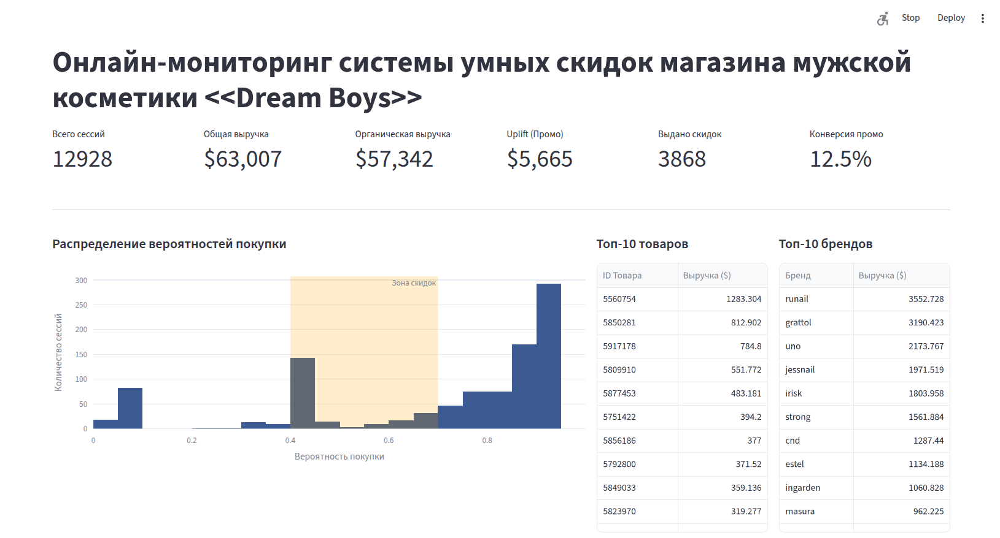
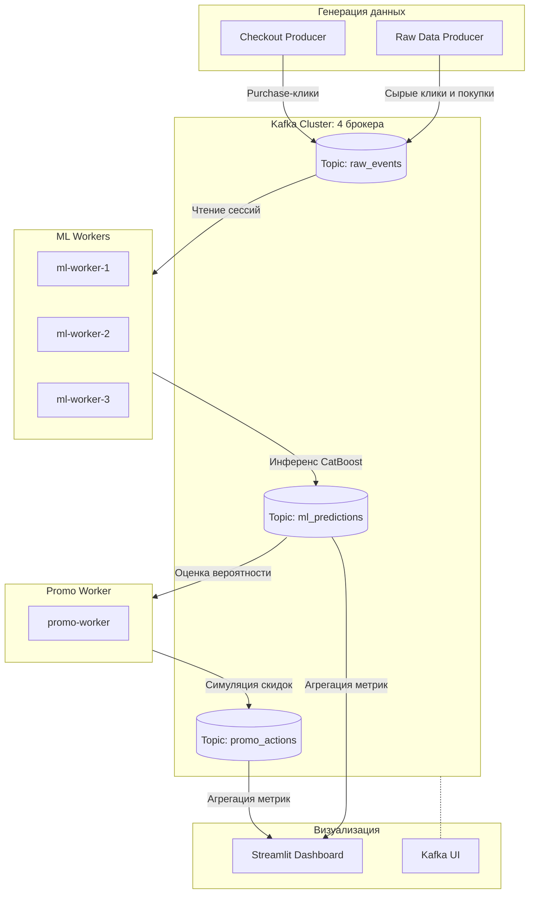
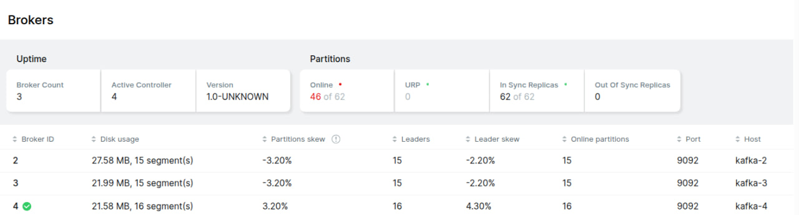
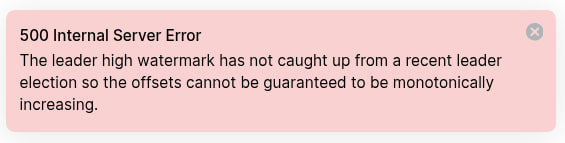
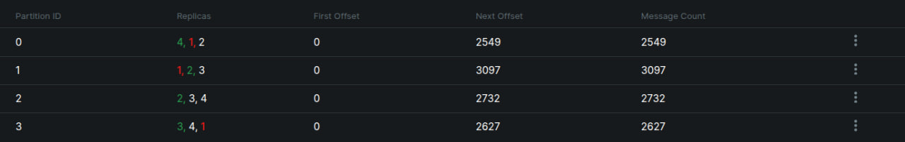
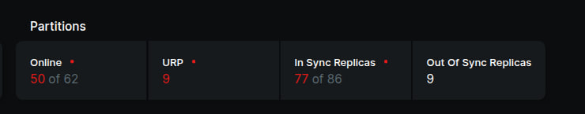
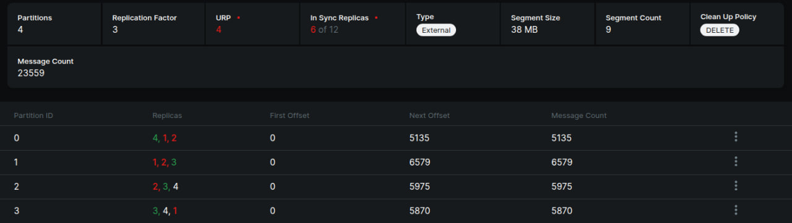

# Автоматизация выдачи скидок в онлайн магазине косметики (Kafka Lab)



## Запуск

Для запуска пайплайна требуется запустить одну команду:
```bash
docker compose up -d --build
```

### Запуск интерфейсов

Чтобы глянуть дашборд, перейдите по ссылке 'http://localhost:8501'

Чтобы глянуть состояние кафка-сети, перейдите по ссылке 'http://localhost:8089'

### Опционально

Если захочется поиграться с контейнерами:
- Чтобы убить контейнер (* -- это номер кафка-контейнера):
	```bash
	docker compose down kafka-*
	```
- Чтобы восстановить:
	```bash
	docker compose up -d kafka-*
	```
	- Если не поднимется, то сделать рестарт живого контейнера:
		```bash
		docker compose restart kafka-*
		```

То же самое можно сделать с консьюмерами (для проверки работоспособности системы), `<consumer_name>` -- это либо `promo-worker`, либо `ml-worker-*`, либо `streamlit-ui`:
- Убить:
	```bash
	docker compose down <consumer_name>
	```
- Поднять и сделать рестарт -- точно также, через `docker compose up -d` и `docker compose restart`

### Запуск песочницы с ноутбуком

Если захочется запустить `analyze-data.ipynb`, то достаточно написать:
```bash
docker compose up -d --build sandbox
```

Затем просто подключиться по `http://localhost:8888` через VS Code.

## Информация о датасете

Ссылка на датасет:
- https://www.kaggle.com/datasets/mkechinov/ecommerce-events-history-in-cosmetics-shop

Описание:
- Датасет содержит клики (журнал взаимодействий пользователей) в онлайн магазине косметики
- Есть несколько типов взаимодействий пользователя с сайтом: view (просмотр товара), cart (добавление в корзину), remove_from_cart (убрать из корзину), purchase (совершить покупку)

**Поставленная задача**:
  - Предсказать вероятность покупки пользователем товара на основе истории его взаимодействий внутри сессии.
  - Предсказывать вероятность требуется для того, чтобы определить людей, которые мечутся между "купить" и "отказаться от покупки", склонив их к приобретению товара посредством предоставления персонального предложения.
  - Промо-акция в данном случае выбрана как "Скидка 10%".
  - Склонить к покупке требуется для более эффективного сбыта товара пользователям и оптимизации расходов на, допустим, склад или на логистику.

## Архитектура пайплайна

В данной лабораторной работе представлен пайплайн из 3-х групп консьюмеров, 2-х продюсеров и группа из 4-х брокеров. На схеме представлен граф взаимодействия между каждым элементом звена.

В схеме используются следующие топики:
- `raw_events`: сырые данные на входе на входе, имеющие важное свойство -- `session_id`, которое потом распараллеливается на `ml_worker`-ов.\
- `ml_predictions`: результаты инференса ml-модели (вероятность покупки от 0 до 1) и факты органических покупок (если из `checkout_producer` прилетели данные с `purchase`).
- `promo_actions`: информация о выдаваемых промо-акциях (выдача скидки).

Продюсеры в схеме:
- `raw_data_producer`: читает исторический датасет порциями и транслирует события `view`, `cart`, `remove_from_cart`.
- `checkout_producer`: Параллельно транслирует события `purchase` (органические покупки).
- Оба продюсера пишут сырые данные в единый топик `raw_events`.

Консьюмеры:
- `ml-worker` (3 инстанса): читают из `raw_events`. Агрегируют историю действий в рамках `session_id`, о котором говорилось ранее. При достижении порога событий передают вектор признаков в предобученную модель. Результат пишут в `ml_predictions`.
- `promo-worker`: читаем `ml_predictions`. Реализует бизнес-логику: отбирает пользователей с вероятностью покупки от 40% до 70%, имитирует выдачу скидки 10%, симулирует поведение пользователя при получении скидки (повышает вероятность купить товар из-за промо-акции) и рассчитывает конверсию. Результат пишет в `promo_actions`.
- `streamlit-ui`: подписан на топики `ml_predictions` и `promo_actions`. На лету рассчитывает экономические показатели (выручка, маржа) и строит графики.

Для отслеживания состояния системы kafka (брокеров, консьюмеров, продюсеров) используется отдельный контейнер с `Kafka UI`. Результаты экспериментов о работе пайплайна в том числе были взяты именно оттуда.



## Эксперименты с конфигом Kafka

В задаче была поставлена задача поиграться с `replication_factor` и `in-sync-replicas`, которые представлены параметрами `KAFKA_CFG_DEFAULT_REPLICATION_FACTOR` и `KAFKA_CFG_MIN_INSYNC_REPLICAS` соответственно.

Остальные параметры можно найти в `docker-compose.yml`. Отдельно стоит уточнить, что данные разбивались на четыре части (по числу брокеров в схеме), для этого использовался параметр:
- `KAFKA_CFG_NUM_PARTITIONS: 4`

### Эксперимент 1

Попробуем посмотреть на систему в базовой форме:
- `KAFKA_CFG_DEFAULT_REPLICATION_FACTOR`: 1
- `KAFKA_CFG_MIN_INSYNC_REPLICAS`: 1

Если запустить сеть с такими параметрами, то она станет максимально неустойчивой к повреждениям брокеров.



При убийстве одного kafka-брокера случается следующее:
1) Все продюсеры и консьюмеры останавливаются и перестают читать/отправлять данные в топики
2) Один из консьюмеров отваливается (на каждом запуске свой)
3) Интерфейс Kafka UI держится и не отваливается, просто сама сеть становится парализована вплоть до момента, пока убитый брокер не будет восстановлен.

**Итог схемы:** не использовать, кафка была предназначена для отказоустойчивых систем без потерь данных, здесь же и потери данных есть (при убийстве брокера 25% данных теряются безвозвратно, после восстановления брокера данные не гонятся дальше), и сеть парализуется.

### Эксперимент 2

Можно посмотреть на другой вариант:
- `KAFKA_CFG_DEFAULT_REPLICATION_FACTOR`: 4
- `KAFKA_CFG_MIN_INSYNC_REPLICAS`: 2

Здесь поведение отличается. При убийстве одного брокера у нас получается следующая ситуация:
1) Продюсеры продолжают работать (`raw_data`) пополняется со временем
2) Консьюмеры останавливаются и не генерируют следующие топики
3) Может отвалиться один из консьюмеров
4) Сеть продолжает висеть

Также будет и при следующем убийстве брокера (если же ISR (in-sync replicas) сделать равным 3, то не будет). На третьем сеть уже полноценно ляжет с ошибкой `500 Internal Server Error`.



**Итог схемы**: не использовать. Сеть частично станет парализованной, хотя данные останутся, будут правильно дублироваться и при восстановлении брокера продолжит гнатся по сети.

### Эксперимент 3

Можно посмотреть ещё один вариант:
- `KAFKA_CFG_DEFAULT_REPLICATION_FACTOR`: 2
- `KAFKA_CFG_MIN_INSYNC_REPLICAS`: 4

Поведение простое: сеть просто ляжет с ошибкой `500`.
1) Отваливается консьюмер
2) Вся сеть останавливается
3) Kafka UI не отвечает


**Итог схемы**: не использовать.

### Эксперимент 4

Последний, самый сбалансированный вариант:
- `KAFKA_CFG_DEFAULT_REPLICATION_FACTOR`: 3
- `KAFKA_CFG_MIN_INSYNC_REPLICAS`: 2

Здесь поведение такое, какое изначально было запланировано разработчиками:
1) При убийстве одного кафка-брокера сеть продолжает *полноценно функционировать*.
   1) Консьюмеры остаются на месте и продолжают считывать и посылать информацию в топики
   2) Продюсеры продолжают читать данные и отправлять в брокеров
   3) Все данные сохранены, т.к. при потере данных из одного брокера эти же данные дублируются в ещё два.




2) При убийстве же второго брокера сеть ложится, пока не восстановится брокер:
   1) Отваливается консьюмер
   2) Вся сеть останавливается
   3) Kafka UI не отвечает



**Итог схемы**: настоятельно рекомендуется к использованию. Система устойчива к потере одного брокера и надёжно сохраняет данные в необходимом количестве дубликатов, после восстановления брокеров пайплайн продолжает работать.

